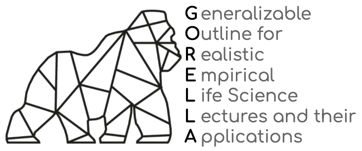

## "What's in this repository?"

This repository contains the basic skeleton for G0RELLA lectures.

We've tried to document the various aspects of G0RELLA with a whole bunch of README files, so feel free to jump around and check things out.

The idea is that specific G0RELLA projects follow the same general setup to increase openness, interoperability, reproducibility and transparency.
In order to make this as easy and standardized as possible, we created this basic skeleton in form of a GitHub repository. With that, interested
lectures can simply fork this repository and fill it with their own field-specific content.
A corresponding tutorial is available [here]() in the general [G0RELLA docs](). 

## "I have some questions..."

[Open an issue]() on this repository and someone will try and get back to you as soon as possible!
