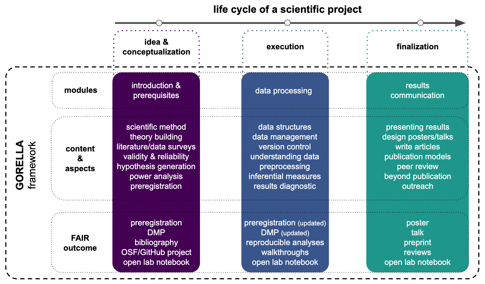

# General outline

The following diagram shows the application of the GORELLA framework to the
life cycle of a scientific project. This includes the collection of ideas and
conceptualization, followed by execution and finalization of the project.

The GORELLA framework is thus sub-divided into modules that fit the
aforementioned project steps. As an example for a lecture focused on
neuroscience research, we provide a set of contents and outcomes for each of
the modules as a basis for the practical implementation of the framework.
 

