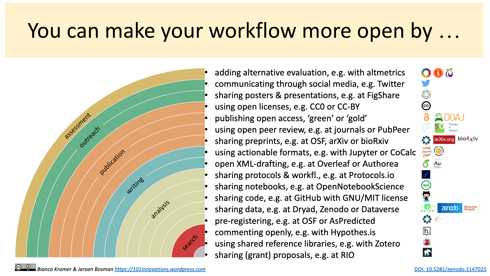

# General procedure

Provide information regarding the general procedure and methods thar are
to be used in your lecture to make sure everyone can follow along and
become an active part of it.
This includes dates, times, infrastructure, materials, software, etc.

You can use the rainbow of Open Science as a guide.

